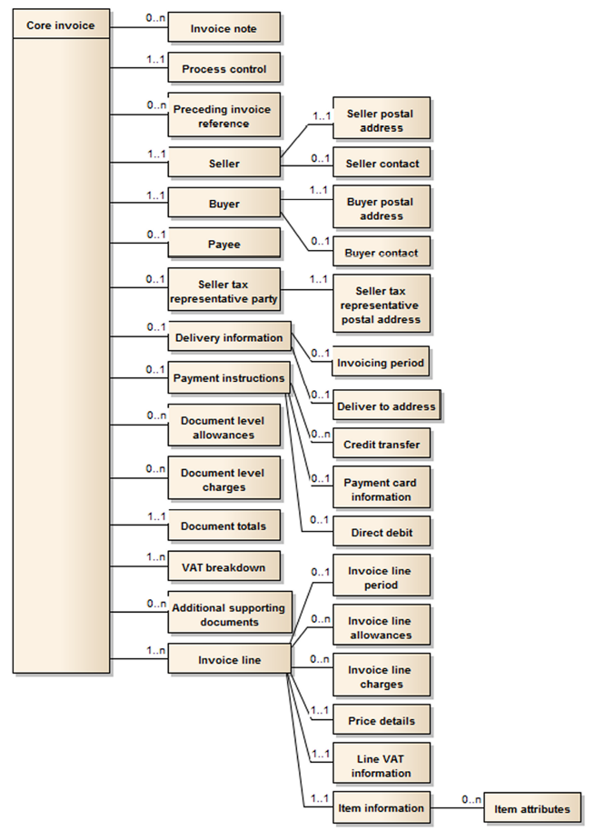

# e-invoice

- "e-" as [electronic invoice](https://en.wikipedia.org/wiki/Electronic_invoicing)
- "e-" as "€uro invoice" conforming to an european CIUS “Core Invoice Usage Specification” 

The goal is to have a jar, which can be used to create a valid xml invoice conforming to german [XRechnung](https://de.wikipedia.org/wiki/XRechnung) or european standard [EN16931-1:2017](https://standards.cen.eu/dyn/www/f?p=204:110:0::::FSP_LANG_ID,FSP_PROJECT:25,60602&cs=17E89F8487E3C0558D35491BC876B7E8C).

The goal is not to build a validator for a xml invoice. For this use [EN-16931 - Validation artefacts](https://github.com/CenPC434/validation) or [XRechnung validator](https://github.com/itplr-kosit/validator).

## european standard EN16931-1:2017
defines a semantic data model for a core invoice. This "€uro invoice" standard uses two syntax schemes alternatively. You have a choice:

- [UN/CEFACT](https://www.unece.org/cefact.html) Cross Industry Invoice XML message, [SCRDM-CII(zip)](https://www.unece.org/fileadmin/DAM/cefact/xml_schemas/D16B_SCRDM__Subset__CII.zip)
- [OASIS](https://en.wikipedia.org/wiki/OASIS_(organization)) Universal Business Language (UBL 2.1) for invoice and credit note, [ISO/IEC 19845:2015](https://en.wikipedia.org/wiki/Universal_Business_Language#UBL_2.1_(ISO/IEC_19845:2015)_and_UBL_2.2)

### What is a CIUS?
_The EN16931 data model contains many optional elements. Specific countries, groups, or organisations may create individual specifications for the core model in their respective domains (known as a ‘CIUS’)._

_A “Core Invoice Usage Specification” (CIUS) is a specification that provides a seller with detailed guidance, explanations and examples, as well as rules (business rules) related to the actual implementation and use of structured information elements present in the core invoice model in a specific trading situation. An instance document created following a given CIUS shall always be compliant with the European Standard EN16931-1:2017._ [[peppol.eu]](https://peppol.eu/core-invoice-usage-specification-cius-use-peppol/)

- [Registry of CIUS (Core Invoice Usage Specifications) and Extensions](https://ec.europa.eu/cefdigital/wiki/display/EINVCOMMUNITY/Community-driven+Registry+of+CIUS+(Core+Invoice+Usage+Specifications)+and+Extensions)
- [XRechnung(de)](http://www.xoev.de/de/xrechnung) is a german specification (CIUS) for EN16931 and is part of [ZUGFeRD](https://de.wikipedia.org/wiki/ZUGFeRD)
- the french counterpart is called [Factur-X(en)](http://fnfe-mpe.org/factur-x/factur-x_en/) [(fr)](http://fnfe-mpe.org/factur-x/)

## Example 
this snippet creates a valid ubl invoice [see (xrechnung-testsuite)](https://github.com/itplr-kosit/xrechnung-testsuite/blob/master/src/test/business-cases/standard/01.01a-INVOICE_ubl.xml)

```java
  static final String XRECHNUNG_12 = CoreInvoice.PROFILE_XRECHNUNG;
  static final String EUR = "EUR"; 
...
  GenericInvoice<InvoiceType> ublInvoice =
    GenericInvoice.createInvoice(XRECHNUNG_12, null, DocumentNameCode.CommercialInvoice);
  ublInvoice.setId("123456XX");
  ublInvoice.setIssueDate("2016-04-04");
  ublInvoice.setNote("Es gelten unsere Allgem. Geschäftsbedingungen, die Sie unter […] finden."); // optional
  ublInvoice.setDocumentCurrency(EUR);
  ublInvoice.setOrderReference("1234567890");           // optional
  ublInvoice.setBuyerReference("04011000-12345-34");
...
  CoreInvoiceLine line = GenericLine.createInvoiceLine("1"  // invoice line number
    , new Quantity("XPP", new BigDecimal(1))
    , new Amount(EUR, new BigDecimal(288.79))               // line net amount
    , new UnitPriceAmount(EUR, new BigDecimal(288.79))      // price
    , "Zeitschrift [...]"                                   // itemName
    , TaxCategoryCode.StandardRate, new BigDecimal(7));     // VAT category code, rate 7%
  ublInvoice.addLine(line);
...
  transformer.fromModel(ublInvoice);
```
- in [AD-e-invoice](https://github.com/klst-de/AD-e-invoice) the jar is used to create "€-invoices" within an ERP-System.

## Core Invoice Overview


