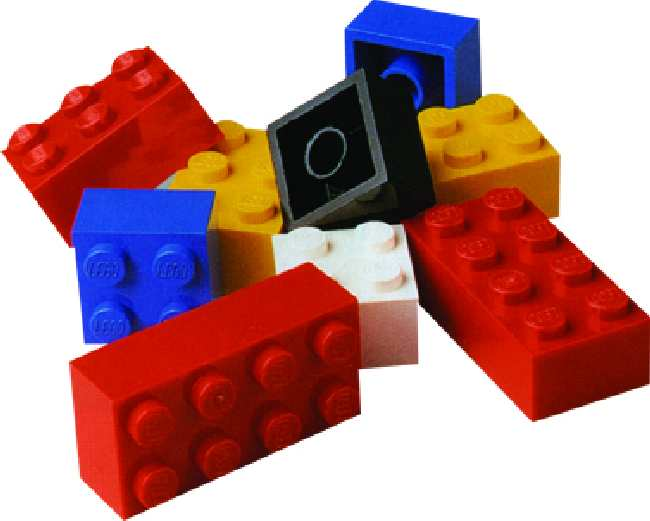

# Baukasten (de)

Die e-order und e-invoice sind modular aufgebaut.



## Übersicht über das Interface Modell

Beispiel: Anschrift

```java
   createAddress(DE, "50600", "Köln");
```

Aus elementaren Komponenten wird mittels einer factory Methode eine neue Komponente gebaut.
So entstehen aus Adressen und Kontaktdaten und weiteren elementaren Dataten wie Handelsname, Steuernummer, ... Geschäftspartenerobjekte füe Käufer und Verkäufer:

```
   PostalAddress --- extends ---> PostalAddressFactory
         ^      <---- create -----
         |
         |
BusinessPartyAddress 
         ^
         |
         |
BG8_BuyerPostalAddress           
^
|
|       Contact <---------------> ContactFactory
|          ^
|          |
|          |
|  BusinessPartyContact
|          ^
|          |
|          |
+->BG9_BuyerContact
|
|
+->BusinessParty <---------------> BusinessPartyFactory
|
BG7_Buyer extends BusinessParty, BG8_BuyerPostalAddress, BG9_BuyerContact
```
