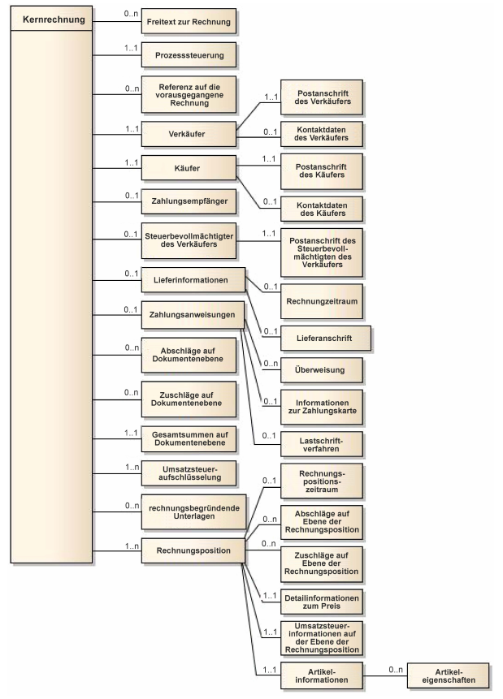
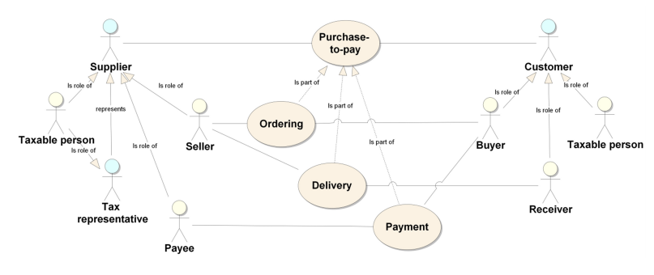
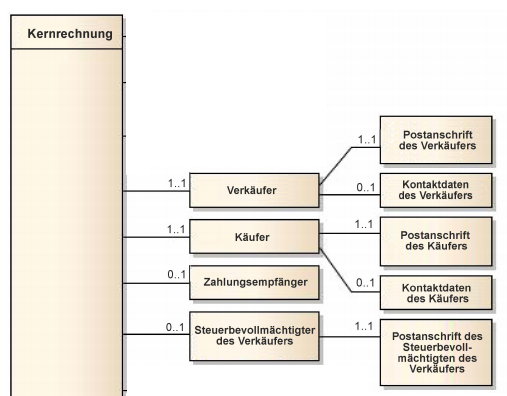
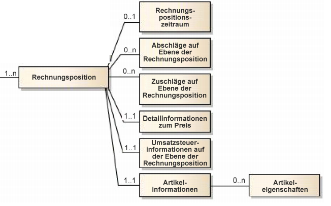

# Beispiele (de)

Das Einführungsbeispiel gab es bereits im [README](https://github.com/klst-de/e-invoice#example). Zum Verständnis Der Beispiele verweise ich auf die DIN-EN16931-1, dem "€uro invoice" Standard.

## Übersicht über das EN16931 Modell



## Beteiligte Geschäftspartner

Im [Vertriebsprozess](https://klst.gitbook.io/adempiere/usr/2.3-sales) gibt es zwei Geschäftspartner, den Verkäufer (Seller/Supplier) und den Käufer (Buyer/Customer). Jeder Partner kann im Prozess mehrere Rollen ausüben.

- der **Verkäufer** ist i.A. auch der Lieferant und der **Zahlungsempfänger** (Payee)
- der **Käufer/Kunde** kann auch Empfänger der Waren oder Dienstleistungen sein

Beide Geschäftspartner sind i.A. umsatzsteuerpflichtig. Der Verkäufer darf seine Rolle an einen **Steuerbevollmächtigten** delegieren, der die Umsatzsteuer in seinem Namen ausweist und bezahlt.

Die Rolle des Zahlungsempfängers darf an einen weiteren Geschäftspartner delegiert werden ([Factoring](https://de.wikipedia.org/wiki/Factoring)).



### Die Geschäftspartner im Modell



### Geschäftsregeln für Rechnungen

siehe auch [rechtliche Anforderungen an eine Rechnung](https://de.wikipedia.org/wiki/Fakturierung#Mindestanforderungen)

- BR-6: Eine Rechnung muss den Namen des Verkäufers (BT-27) enthalten.
- BR-7: Eine Rechnung muss den Namen des Käufers (BT-44) enthalten.
- BR-8: Eine Rechnung muss die Postanschrift des Verkäufers (BG-5) enthalten.
- BR-9: Eine Postanschrift des Verkäufers (BG-5) muss einen Ländercode der Verkäuferanschrift (BT-40) enthalten.
- BR-10: Eine Rechnung muss die Postanschrift des Käufers (BG-8) enthalten.
- BR-11: Die Postanschrift des Käufers muss einen Ländercode der Käuferanschrift (BT-55) enthalten.

### Beispiel Verkäufer und Käufer

Das folgende Beispiel definiert den Verkäufer und den Käufer und damit erfüllt es die ersten vier Regeln. Auch BR-11 ist erfüllt. Nicht jedoch BR-10, in der Adresse der Käufers fehlt die "Straße aka address line 1":

```java
  static final String DE = "DE";  // country code 
...
	// BusinessParty Seller aka Supplier
	PostalAddress sellerAddress = invoice.createAddress(DE, "12345", "[Seller city]");
	sellerAddress.setAddressLine1("[Seller address line 1]");
	ContactInfo sellerContact = null;                       // (optional)
	invoice.setSeller("[Seller name]", sellerAddress, sellerContact, 
		"[HRA-Eintrag]", "123/456/7890, HRA-Eintrag in […]");
		  
	// BusinessParty Buyer aka Customer 
	PostalAddress buyerAddress = invoice.createAddress(DE, "12345", "[Buyer city]");
	ContactInfo buyerContact = null;                        // (optional)
	invoice.setBuyer("[Buyer name]", buyerAddress, buyerContact);
...
```

Die Methode `setSeller(String name, PostalAddress address, ContactInfo contact, String companyId, String companyLegalForm)` ist eine Kurzschreibweise für `setSeller(BusinessParty party)`:

```java
   // alternativ:
   String sellerName = "[Seller name]";  // BT-27 formelle Name des Verkäufers
   String tradingName = null;            // BT-28 Handelsname des Verkäufers
   BusinessParty seller = invoice.createParty(sellerName, tradingName, sellerAddress, sellerContact);
   seller.setCompanyId("[HRA-Eintrag]"); // BT-29 Kennung des Verkäufers
   seller.setCompanyLegalForm("123/456/7890, HRA-Eintrag in […]"); // BT-30 rechtliche Registrierung
   invoice.setSeller(seller);
```

Die Adresse der Käufers ist einfach zu vervollständigen: `setAddressLine1(...)`. Auch die optionalen Kontaktdaten lassen sich einfach ergänzen:

```java
...
	String contactName = "nicht vorhanden";
	String contactTel  = "+49 1234-5678";
	String contactMail = "seller@email.de";
	ContactInfo sellerContact = invoice.createContact(contactName, contactTel, contactMail);
...
```

### Beispiel Factoring

Die Rolle des Zahlungsempfängers darf auch von einem anderen Geschäftspartner als dem Verkäufer, z. B. von einem Factoringdienst, ausgeübt werden.

- BR-17: Falls der Zahlungsempfänger (BG-10) nicht mit dem Verkäufer (BG-4) identisch ist, muss seine Firmierung/sein Name in der Rechnung (BT-59) angegeben werden

Die facturx API hat dafür die Methode `setPayee`:

	public interface CoreInvoice ...
	public void setPayee(String name, String id, String companyId);


### Beispiel Steuerbevollmächtigte

Der Verkäufer darf seine Rolle an einen Steuerbevollmächtigten delegieren, der die Umsatzsteuer in seinem Namen ausweist und bezahlt. In der Rechnung müssen weitere Regeln beachtet werden:

- BR-18: Falls sich der Verkäufer (BG-4) durch einen Steuerbevollmächtigten (BG-11) vertreten lässt, muss dessen Name (BT-62) in der Rechnung angegeben werden.
- BR-19: Falls sich der Verkäufer (BG-4) durch einen Steuerbevollmächtigten (BG-11) vertreten lässt, muss die Postanschrift des Steuerbevollmächtigten des Verkäufers (BG-12) in der Rechnung angegeben werden.
- BR-20 Falls sich der Verkäufer (BG-4) durch einen Steuerbevollmächtigten (BG-11) vertreten lässt, muss die Postanschrift des Steuerbevollmächtigten des Verkäufers (BG-12) den Ländercode der Steuerbevollmächtigtenanschrift (BT-69) enthalten.

Ähnlich wie bei Payee gibt es auch dafür eine Methode `setTaxRepresentative`.

## Rechnungspositionen



### Geschäftsregeln für Rechnungspositionen

jede Rechnungsposition muss ...
- BR-21: eine Kennung (BT-126) haben, z.B. Positionsnummer
- BR-22: die in Rechnung gestellte Menge (BT-129) und den Code für 
- BR-23: die Maßeinheit (BT-130) aufweisen. Der Maßeinheitcode ist der [UN/ECE](https://de.wikipedia.org/wiki/Wirtschaftskommission_f%C3%BCr_Europa) Recommendation [No. 20/21 „Codes for Units of Measure“](https://wiki.idempiere.org/de/Ma%C3%9Feinheiten#UNECE_recommendation_20.2F21) zu entnehmen. Beispiele: 
  - LTR = Liter, 
  - MTQ = Kubikmeter, 
  - KGM = Kilogramm, 
  - XPP = piece/Stück, 
  - HUR = hour/Stunde
- BR-24 der Nettobetrag der Rechnungsposition (BT-131) angegeben werden
- BR-26: den Nettopreis des Artikels (BT-146) enthalten
- BR-25: den Artikelnamen (BT-153) enthalten
- BR-CO-4: einer Umsatzsteuerkategorie/VAT (BT-151) zugeordnet werden


Die obligatorischen Informationen einer Rechnungsposition sind bereits mit der factory-Methode `createInvoiceLine` abgedeckt:

```java
  CoreInvoiceLine line = invoice.createInvoiceLine("1"      // Rechnungsposition
    , new Quantity("XPP", new BigDecimal(1))                // Code und Menge
    , new Amount(EUR, new BigDecimal(288.79))               // Nettobetrag Rechnungsposition
    , new UnitPriceAmount(EUR, new BigDecimal(288.79))      // Artikelpreis
    , "Zeitschrift [...]"                                   // Artikelname
    , TaxCategoryCode.StandardRate, new BigDecimal(7));     // VAT category code, rate 7%
...  
  invoice.addLine(line);
```

- Rechnungsposition: "1"
- Code und Menge: 1 Stück/XPP
- Nettobetrag der Rechnungsposition: 288.79€
- Artikelpreis: 288.79€
- Artikelname: "Zeitschrift [...]"
- Umsatzsteuerkategorie mit Steuersatz: 7%

Zusätzliche Angaben können angefügt werden:

```java
  line.setNote("Die letzte Abonnementslieferung ... ");     // Bemerkungen
  line.setPeriod("2016-01-01", "2016-12-31");               // Lieferzeitraum
  line.setOrderLineID("6171175.1");                         // Referenz Bestellposition
...  
  invoice.addLine(line);
```

### Detailinformationen zum Preis

Zu dieser Gruppe gehört der **Preisrabatt**. Dieser muss bereits im "Nettopreis des Artikels (BT-146)" einbezogen sein. Um zu zeigen, dass ein Rabatt gewährt wurde, kann der Nachlass (BT-147) auf den brutto Artikelpreis und auch der Bruttopreis (BT-148) angegeben werden:

```java
    , new Amount(EUR, new BigDecimal(288.79))               // Nettobetrag Rechnungsposition
...
  line.setUnitPriceAllowance(new UnitPriceAmount(EUR, new BigDecimal(21.21)) // Nachlass
                            ,new UnitPriceAmount(EUR, new BigDecimal(310))); // Bruttopreis
  invoice.addLine(line);
```

### Abschäge und Zuschläge (Allowance and Charges)

Ein Positionsabschlag kann als Rabatt 2. Ordnung angesehen werden. Bei Abschlägen und Zuschlägen/**Gebühren** (BT-141) kann ein Grund (BT-144) angegeben werden. Der zur Berechnung der Gesamtsumme verwendete Preis ist jedoch immer der Nettopreis (BT-146).

Beispiele:
- einfacher Abschlag auf Positionsebene (BG-27) durch Methode `addAllowance`
- Zuschlag auf Positionsbenbe (BG-28) mit optionaler Angabe der Gründe als Text oder Code aus UNTDID 5189
- Abschlag auf Rechnungsebene (BG-20) mit Steuerangeben

```java
		// BG-27 0..n LINE ALLOWANCES:
BigDecimal tenPerCent = new BigDecimal(10);
line.addAllowance(new Amount(new BigDecimal(6.00)), new Amount(new BigDecimal(60.00)), tenPerCent);
		// BG-28 0..n LINE CHARGES:
AllowancesAndCharges charge = line.createCharge(new Amount(new BigDecimal(6.00)), new Amount(new BigDecimal(60.00)), tenPerCent);
charge.setReasoncode("64");                // UNTDID 5189 code
charge.setReasonText("Special agreement");
line.addAllowanceCharge(charge);
...
		// BG-20 0..n DOCUMENT LEVEL ALLOWANCE:
BigDecimal tenPerCent = new BigDecimal(10);
AllowancesAndCharges allowance = invoice.createAllowance(new Amount(new BigDecimal(31)), new Amount(new BigDecimal(310)), tenPerCent);
allowance.setReasoncode("64");
allowance.setReasonText("SPECIAL AGREEMENT");
allowance.setTaxType(TaxTypeCode.VAT);
allowance.setTaxCategoryCode(TaxCategoryCode.StandardRate);
allowance.setTaxPercentage(new BigDecimal(20));
invoice.addAllowanceCharge(allowance);
```

## Rechnungsbezogene Anlagen

Zu einer Rechnung kann es Anlagen ( SUPPORTING DOCUMENTS ) geben. Beispielsweise ein Stundenzettels, ein Montageprotokoll, Fotos, etc. Die Anlagen sind Belege für die in der Rechnung gestellten Ansprüche. Typischerweise sind solche Belege text- `pdf`- oder Bild-Dateien (`jpeg`, `png`). Diese Dateianlagen sind nicht Bestandteil der Rechnung.

Auf zweierlei Weisen können die Belege der Rechung angefügt werden:

1. als link zu einem externen Dokument (URL)
1. als eingebettete Datei 

```java
	// BG-24 0..n external SUPPORTING DOCUMENT
	String url = "https://beispiel.de/externalSupportingDocument.pdf";
	SupportingDocument sd = invoice.createSupportigDocument("docRefId-1", "description", url);
	invoice.addSupportigDocument(sd);
...	// BG-24 0..n embedded SUPPORTING DOCUMENT
	String PDF = "01_15_Anhang_01.pdf";
	String mimeCode = "application/pdf";
	byte[] content = getBytesFromTestFile(PDF);
	invoice.addSupportigDocument("docRefId-2", "embedded file", content, mimeCode, PDF);
```

Ähnliche XML-Elemente sind 
- Losreferenzen oder Verweise auf eine Ausschreibung, die zum Vertrag geführt hat (BT-17). 
- Oder Verweise, Kennungen für Objekte, auf das sich die Rechnung (BT-18) 
- oder Rechnungsposition (BG-25.BT-128) bezieht.
