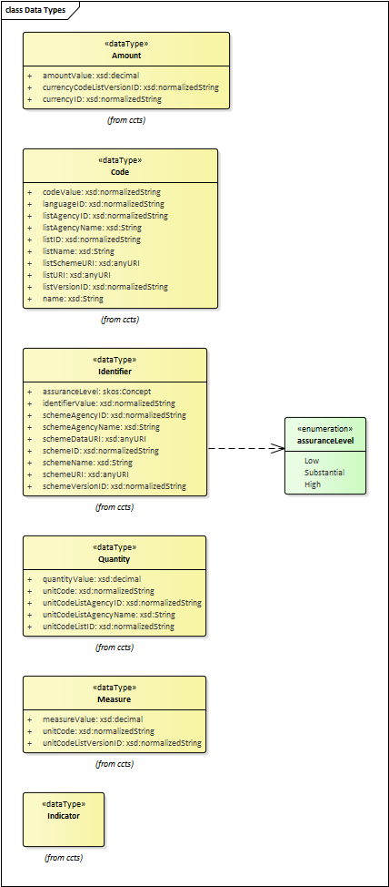

# EbXML data types

The EN16931-1 data model uses primitive types to define invoices. These primitive types were taken from [ISO 15000-5](https://www.iso.org/standard/61433.html) aka [EbXML](https://en.wikipedia.org/wiki/EbXML). This specification defines elements that "wrap" primitive types from the WC3 XML namespace like string, boolean, decimal, etc. and adds attributes and certain semantics to them (e.g. Amount is a numeric value with the attribute "currency", which entails that amounts are always quantities of money).

- you cannot download ISO 15000-5 for free
- but there is a tutorial paper published 2006 by [Mark Crawford](https://www.oasis-open.org/events/symposium/2006/slides/CrawfordTutorial.pdf) with information about the content

Here some data types.

## Amount

A number of monetary units specified in a currency where the unit of currency is explicit or implied.

## Code

A character string (letters, figures or symbols) that for brevity and/or language independence may be used to represent or replace a definitive value or text of a Property.

[Note: The term 'Code' should not be used if the character string identifies an instance of an Object Class or an object in the real world, in which case the Representation Term identifier should be used.] 

## Identifier

A character string used to establish the identity of, and distinguish uniquely, one instance of an object within an identification scheme from all other objects within the same scheme. 

## Indicator

A list of exactly two mutually exclusive Boolean values that express the only possible states of a Property.

[Note: Values typically indicate a condition such as on/off; true/false etc.]

## Measure

A numeric value determined by measuring an object. Measures are specified with a unit of measure. The applicable unit of measure is taken from UN/ECE Rec.20. 

[Note: This Representation Term shall also be used for measured coefficients (e.g. m/s).]

## Quantity

A counted number of non-monetary units. Quantities need to be specified with a unit of quantity.

[Note: This Representation Termshall also be used for counted coefficients (e.g. flowers/m²).]